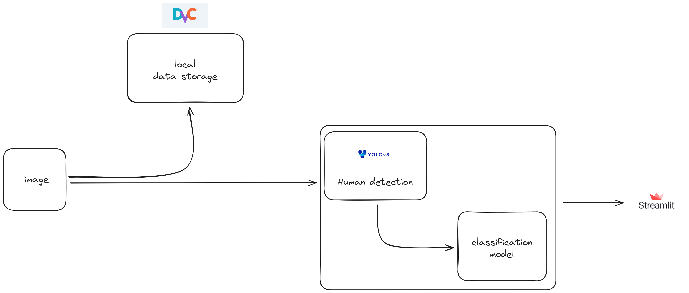

# Scoliosis Prediction
## TODO
### Requirement
- [ ] Yolov8 모델이 사람을 인지하지 못할 경우 전처리 프로세스 보완
- [ ] 타입 별 데이터 추가 되면 타입 추론하는 모델로 변환


### Optional
- [ ] 데이터가 적기 때문에 배경이미지 가져와 사람과 합성 필요(rembg 사용)
- [ ] 모델 바꿔서 실험
- [ ] 이미지와 함께 나이, 성별 등의 tabular 데이터 조합하여 모델 개선 및 학습
- [ ] 척추측만증 여부확인뿐만 아니라 척추 측만증의 클래스를 분류할 수 있도록 모델 개선(데이터 부족으로 개선방향이 보이지 않음)


## How to use

If you want to use v*.* dataset and not wanna change code, then use follwing command
**version list**
- v0.1
```sh
git checkout v*.* data.dvc
dvc checkout data.dvc
```

**Train**
```sh
python main.py --mode=train
```

**Prediction**
```sh
streamlit run streamlit.py
```

---
## Process
